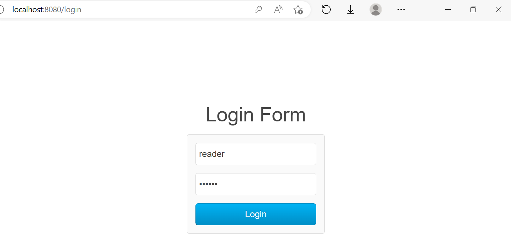
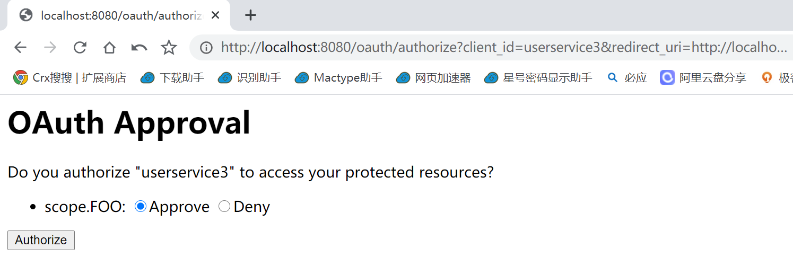

# 访问流程

访问 http://localhost:8082/ui/ 进行登录。当点击 Login 按钮后，跳转到 http://localhost:8082/ui/securedPage。

由于 8082 端口上的服务在 WebSecurityConfig 配置类中配置了/路径和 /login 路径允许匿名访问，其它的路径需要身份认证后才能访问。并且配置了 @EnableOAuth2Sso 注解来启用 OAuth2 单点登录。因此：

- 由于用户没有在 http://localhost:8082/ui 登录，因此 Spring Security 将 http://localhost:8082/ui/securedPage 请求 302 临时重定向至 http://localhost:8082/ui/login
- Spring Security 又将 http://localhost:8082/ui/login 请求 302 临时重定向至 application.yaml 配置文件中指定的 userAuthorizationUri 来引导用户进行授权，允许第三方应用获取用户的信息（Oauth2.0 的授权码模式）http://localhost:8080/oauth/authorize?client_id=userservice3&redirect_uri=http://localhost:8082/ui/login&response_type=code&scope=FOO&state=g431UT
- 由于用户没有在 http://localhost:8080 登录，因此 Spring Security 将 http://localhost:8080/oauth/authorize 请求 302 临时重定向至 http://localhost:8080/login，给用户展示登录页面，用户输入账号密码进行登录。（用户的账号信息存储在数据库中的 users 表）
- 用户点击 “登录” 按钮，通过 http://localhost:8080/login 以 POST 方法发送请求，账号信息以 Form Data 形式提交 _csrf=eec556ab-84bf-4920-a8b8-f88413f48490&username=reader&password=reader
- 用户点击登录按钮后，授权服务器将 http://localhost:8080/login 请求 302 临时重定向至 http://localhost:8080/oauth/authorize?client_id=userservice3&redirect_uri=http://localhost:8082/ui/login&response_type=code&scope=FOO&state=g431UT，给用户展示是否统一授权的页面，让用户进行选择
- 用户点击 “同意授权” 按钮，通过 http://localhost:8080/oauth/authorize 以 POST 方法发送请求，信息以 Form Data 形式提交 user_oauth_approval=true&_csrf=d94325e2-50b7-48f9-a30d-9189f3be3575&scope.FOO=true&authorize=Authorize
- 用户点击 “同意授权” 按钮后，授权服务器将 http://localhost:8080/oauth/authorize 请求 302 临时重定向至 redirect_uri 查询参数指定的 URL，并携带授权码 code 和 state 参数【可用于防止跨站请求伪造（CSRF）攻击】http://localhost:8082/ui/login?code=K7mu0C&state=g431UT
- 8082 端口上的服务将 http://localhost:8082/ui/login?code=K7mu0C&state=g431UT 请求 302 临时重定向至 http://localhost:8082/ui/securedPage

> 登录后的重定向，8080怎么知道client_id=userservice3
>
> stats 参数时候变化
>
> 凭证保存在哪里

# 参考资料

[11 | 实战案例：使用Spring Security搭建一套基于JWT的OAuth 2.0架构 (geekbang.org)](https://time.geekbang.org/column/article/264179)

[朱晔和你聊Spring系列S1E10：强大且复杂的Spring Security（含OAuth2三角色+三模式完整例子） - 掘金 (juejin.cn)](https://juejin.cn/post/6844903703695245326)

